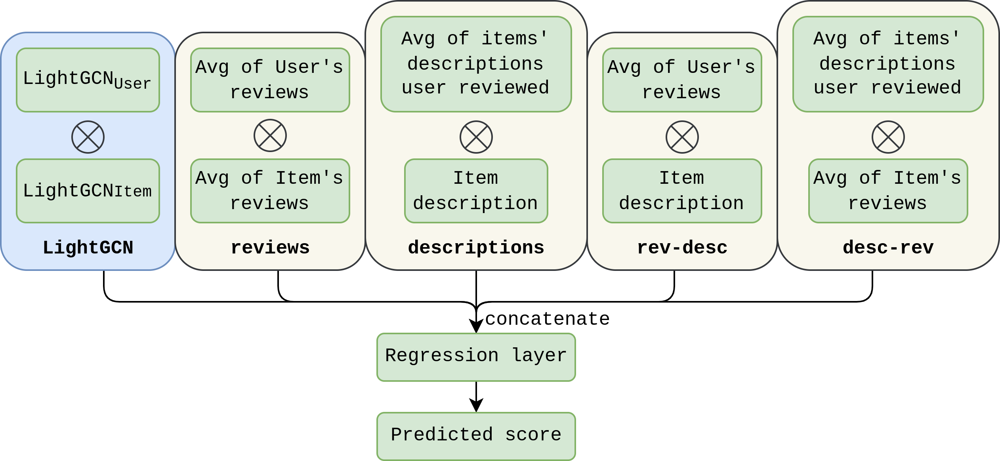

# Augmenting Graph Convolutional Networks with Textual Data for Recommendations

Official repo with code for the ECIR'23 paper ["Augmenting Graph Convolutional Networks with Textual Data for Recommendations"](https://dl.acm.org/doi/abs/10.1007/978-3-031-28238-6_58).

## Running the code
Using `python==3.10`

To run the code:
1. Create a separate environment and install [requirements.txt](requirements.txt). You might want to change the index paths to appropriate cuda versions for your machine.
2. Download the [amazon data](https://cseweb.ucsd.edu/~jmcauley/datasets/amazon_v2/) and put it into the [data](data) folder. I have used reviews and metadata from <b>"Per-category data"</b> table
3. Clean the data using the [`process_data.py`](data/process_data.py) script. It
    * removes the unnecessary columns and features
    * removes the products and users with less than n reviews (n can be specified when calling the `core_n` function, 5 by default)
    * synchronizes the metadata with the reviews (i.e. removes the products that are not in the reviews).
    * creates the train and test splits to save time when running experiments, but the splits can be force-regenerated when running [main.py](main.py) by speicifying the `--reshuffle` flag. </br>
4. Run the [`main.py`](main.py) file by specifying the desired parameters. Here are the most important ones:
```
options:
  --model                       which model to use: {lgcn,adv_sampling,ltr_linear,ltr_pop}
  --data DATA                   folder with the train/test data
  --epochs EPOCHS, -e EPOCHS    number of epochs to train
  --eval_every EVAL_EVERY       how often evaluation is performed during training
  --batch_size BATCH_SIZE       batch size for training and prediction
  -k [K ...]                    list of k-s for metrics @k
  --gpu GPU                     comma delimited list of GPUs that torch can see
  --load_base LOAD_BASE         path to the base LightGCN model to load for training the linear layer on top
```
To train TextGCN model you need to first train a LightGCN model on the same data and then load it as a base model for the TextGCN model.

After the model is trained, the folder `runs` is created, and results for each experiment are saved there:
* `latest_checkpoint.pkl` - the latest checkpoint of the model
* `best.pkl` - the best checkpoint of the model
* `log.log` - the log of the training process
* `progression.txt` - human-readable metrics for each epoch

### Example
For example, to train a TextGCN model described in the paper on the `Electronics` category, you need to first train a default LightGCN model by running
```
python main.py --model lgcn --data data/Electronics --uid lightgcn_electronics
```
and then train the TextGCN model on top of it by running
```
python main.py --model ltr_linear --data data/Electronics --load_base runs/lightgcn_electronics/best.pkl --uid ltr_linear_electronics
```

## Model types

* `lgcn` - default LightGCN model from the original [paper](https://arxiv.org/abs/2002.02126). Defined in the [`BaseModel`](TextGCN/base_model.py#L16) class.
* `adv_sampling` - LightGCN with dynamic negative sampling, selecting several negative samples with highest scores, instead of a random one sample. Better performance but much slower. Defined in the [AdvSamplModel](TextGCN/advanced_sampling.py#L24) class.
* `ltr_linear` - TextGCN model which uses LightGCN score and 4 textual features, combining them in a linear layer on top. Defined in the [LTRLinear](TextGCN/ltr_models.py#L165LTRLinear) class.
Corresponds to the architecture from the paper: 
* `ltr_pop` - same as `ltr_linear`, but also using popularity of the item and the user as features. Defined in the [LTRLinearWPop](TextGCN/ltr_models.py#L206) file.

There are model models in other files, like `text`, or gradient boosted versions I have experimented with, but they are not included in the paper.

Feel free to ask any questions by opening the issues.